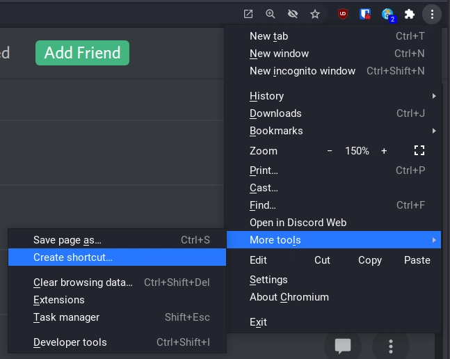
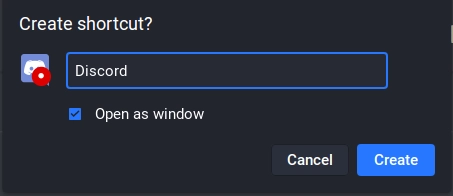
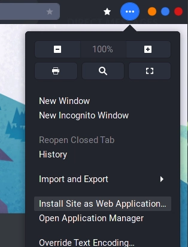
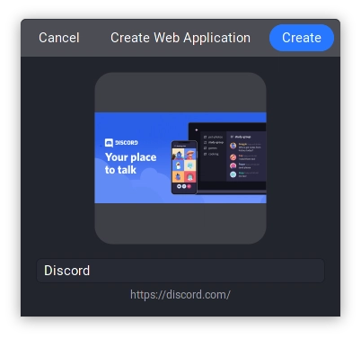
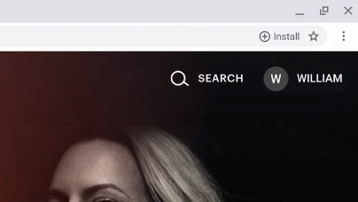

I'm guessing you run quite a few electron applications on your computer. Its the modern trend of development of desktop application these days. And I don't like it.

The idea of Electron is flawed. Where each program packages an entire chromium engine with some extra JavaScript that allows you see and manipulate almost anything on your computer. Also if you run multiple electron based apps, each one of them will start up a completely new chromium engine just to handle that one application. On slower systems this can become a real resource hog.

There are also real security and privacy issues when many of these electron based packages also run lots of custom JavaScript with out of date libraries and package old electron versions with known vulnerabilities.

By using Chromium as an alternative to running Electron applications on your computer, you can avoid many of the issues that Electron creates. It also gives you a very nice performance boost, since it uses the same up to date chromium engine in the background. Another bonus with webapps is that it puts you back in control over permissions as well.


**Note:** This is not a blog post for developers and more a users survival guide to the internet of applications, specifically under linux.


## Installing a website

I recommend installing chromium, but chrome can also work if you prefer that. The steps are the same. Be aware to not use the flatpak versions as they have issues when using this method. See [Notes](#notes) for more about why.

1. Open chromium and go to the desired website you want to install and log in.
2. When logged in and in the webapp, click the 3 dot menu on the right, more tools and click "Create shortcut"

3. Check off "Open as window" to have it open as a separate window from chrome.

4. You will now have the website installed as an application.


## Icon issues

Usually chromium will install a high res `.svg` or `.png` for you automatically. But some sites do not support this properly and might make chromium choose a blurry `.ico` instead.

So if you struggle with that the icon is too low res, or simply that you don't like the default one that Chromium selected for you, there are simple ways to fix that. But you will have to open the terminal to do it.

So open your terminal and cd into this directory:

```console
cd ~/.local/share/applications/
```

Here is where all your user-specific `.desktop` files go. These describe how your programs show up and run. If you do an `ls` in this directory you might see a few of your installed applications, but right now  we are only interested in what chromium has created for us. So lets do that:

```console
$ ls | grep chrome
chrome-magkoliahgffibhgfkmoealggombgknl-Default.desktop
```

Now we only see the applications that chromium has installed for us. Sadly these aren't named in a human readable way. So we need to use cat or a similar tool to see which `.desktop` file is for what site.

```desktop {{filename="chrome-magkoliahgffibhgfkmoealggombgknl-Default.desktop"}}
[Desktop Entry]
Version=1.0
Terminal=false
Type=Application
Name=Discord Web
Exec=/usr/bin/chromium --profile-directory=Default --app-id=magkoliahgffibhgfkmoealggombgknl
Icon=crx_magkoliahgffibhgfkmoealggombgknl
StartupWMClass=crx_magkoliahgffibhgfkmoealggombgknl
```

In here we are only interested in the `Icon=` and `Name=` parts. Name= will show you which site this is for, and `Icon=` is which icon it will use for the desktop shortcut.

You can use your favorite editor to edit this `Icon=` line. If you are new to command line editors, here's a quick rundown on how to use nano.

### How to use nano

Run `nano chrome-magkoliahgffibhgfkmoealggombgknl-Default.desktop` to start the editor. Use the arrow keys to get where you want to edit, do the changes that will be explained below on the `Icon=` line. Hit `CTRL+X` then `y` and `Enter` to save. If you messed up you can alternatively press n instead to discard the changes you did and try again.

### Using a custom icon pack

If you have a icon pack where the icon is included you just set it to the programs name. Example here it would be `Icon=discord`.

### Manually downloading the file icon

First you will have to find the programs icon online, preferably in a `.svg` format, but a `.png` would also work.

Once you have downloaded for example `discord.svg` you will have to move it into a folder called `/usr/share/pixmaps`. You will need root for this. If you don't have access to root, look below for a rootless way to do it.

Follow these steps to move it into the folder. You will also need to set the owner and group of the file to `root:root`, which is done with the `chown` command.

```console
$ ls -lha | grep discord
-rw-r--r--  1 USERNAME USERNAME 1.1K Mar 22 17:26 discord.svg
$ sudo chown root:root discord.svg
$ sudo mv discord.svg /usr/share/pixmaps/
$ ls -lha /usr/share/pixmaps/ | grep discord
-rw-r--r--   1 root root 1.1K Mar 22 17:26 discord.svg
```

Now you should be able to set your `.desktop` file icon with `Icon=discord.svg`. You might have to relog to see the changes.

### Manual icon method for those without root

If you don't have access to root, you can create a `~/.custom-icons/` folder and put the icon in there. Preferably the file is a `.svg` or `.png` format. Now set the desktop file to point to it directly: `Icon=/home/USERNAME/.custom-icons/discord.svg`.

Save and relog to see the changes.

## Notes

### Using GNOME Web as an alternative to Chromium

If Chromium doesn't tickle your fancy, you can use GNOME Web instead as your browser of choice. It will also respect your default browser choice when opening links. But can have strange performance issues, missing features and graphical hiccups (notably on NVIDIA GPUs).

To install a webapp, open GNOME Web, log in to the webapp, click the 3 dot menu and then "Install Site as Web Application".




You can follow the [Icon Issues](#icon-issues) written above to fix the icon. The desktop file will be named in the style of `org.gnome.Epiphany.WebApp-discord-[...].desktop`.

### What about Firefox?

Sadly Firefox removed their own implementation of installable web apps recently, and they have no intention of supporting it any time in the future. As much as I love using Firefox, this is currently only a thing that Chromium supports.

<https://bugzilla.mozilla.org/show_bug.cgi?id=1682593>

### Solving Discord's performance issues by using Chromium

Ever since Discord's 0.10 update, it has become some of the most unstable software that i have run on my computer to date.

Are you in voice chat? It will crash after a while. Texting friends? It will slowly become so laggy you cant even see what you are texting. Live streaming to friends? It can crash the entire computer.

And this is not just a thing i have been experiencing, it seems to be an actual issue of Discord as a whole under linux. And topping the cake is the Discord themselves has done nothing about it for well over a year now.

<https://support.discord.com/hc/en-us/community/posts/360068141732-Linux-App-Consistently-Crashes-throughout-the-day>

<https://support.discord.com/hc/en-us/community/posts/360052632473-Discord-extremely-laggy-on-arch-linux>

### Using Flatpak?

You cant use flatpak currently for installable web apps. It has some weird issues with the grouping of running programs. I have tried to look into this myself and talked to one of the maintainers of the flatpak version, but the cause was not as easy to find as we'd hoped.

For now you have to use the package distributed to you trough your distros package manager until this gets sorted.

### Installable Progressive Web Apps

This "Create shortcut" is just a manual way to install any page as a web app. But if a site meets all the criteria for being a "Installable Progressive Web App" it will give you a install button in the address bar. If you see this icon it is the preferred method of installing a website. So use that instead.



### Any downsides?

Yes there is one downside that i have yet to figure out a way around. Opening links inside of a webapp running under chromium will open it in a chromium tab. It does not respect your default browser choice.

Currently i do "Right Click -> Copy link address" for any links i want to visit. Becomes habit rather quickly but its not for everyone.

Please do write a comment below if you have any ideas how one could work around this limitation as i prefer to use Firefox for my day to day web browser.
